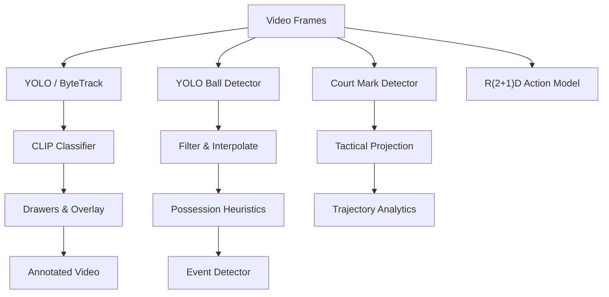
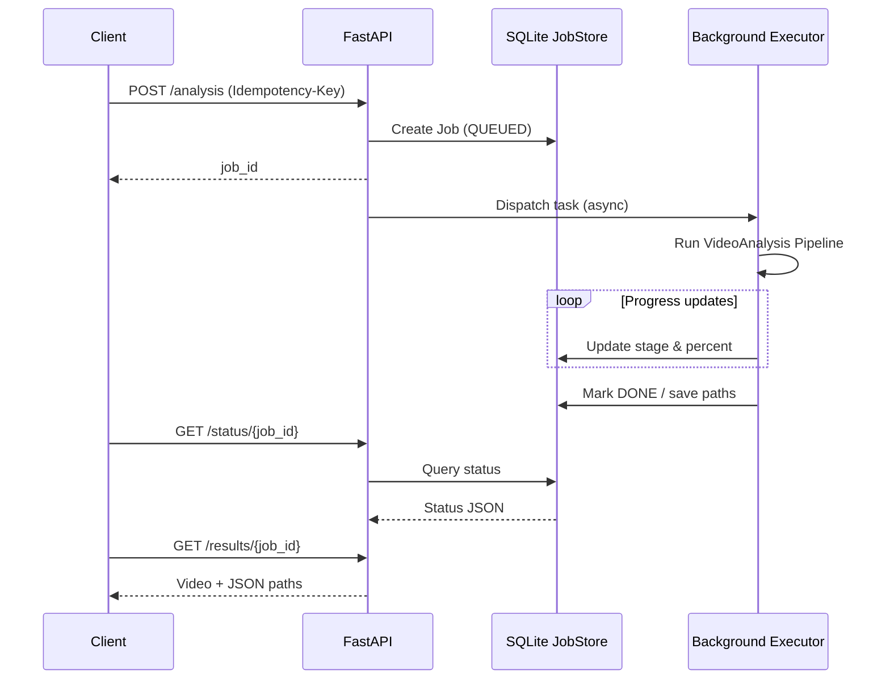

# CourtVision Engine 🏀
[](https://github.com/lee0721/courtvision-engine/actions/workflows/pytest.yml)


CourtVision Engine is a computer-vision toolkit for breaking down half-court basketball footage. The
pipeline combines multi-object tracking, jersey-based team classification,
ball-possession heuristics, tactical-view projection, and action recognition to
produce an annotated video that surfaces passes, interceptions, and per-player
movement metrics.

### 🎥 Demos & Walkthroughs

- **🚀 Explanation Video (Technical Deep Dive)**:  
  [**Click to Watch on Google Drive** ↗](https://drive.google.com/file/d/1-hqNvQog2tOV4v0bxwxdczk2CtINs8SM/view?usp=sharing)  
  *A comprehensive walkthrough of the system architecture and pipeline stages.*

- **🏀 System Demo (2 min)**  
  <video controls width="640">
    <source src="https://cdn.jsdelivr.net/gh/lee0721/courtvision-engine@main/demo_silent.mp4" type="video/mp4">
    ▶️ <a href="https://cdn.jsdelivr.net/gh/lee0721/courtvision-engine@main/demo_silent.mp4">demo.mp4</a>
  </video>  

## Features ✨
- **Player & ball tracking** – YOLOv8 detections paired with ByteTrack keep
  persistent IDs for every player while a separate detector follows the ball,
  filters false positives, and interpolates missing frames.
- **Team classification with CLIP** – automatically assigns each tracked player
  to a jersey label (e.g., `dark blue shirt` vs `white shirt`) so downstream
  overlays can stay colour consistent.
- **Possession and event detection** – heuristics determine who controls the
  ball, then emit pass and interception events in real time.
- **Court keypoint extraction** – detects court markings, validates them, and
  builds the homography needed to project activity onto a tactical top-down
  map.
- **Trajectory kinetics** – converts projected positions into distance (m) and
  speed (km/h) metrics per player over time.
- **Action recognition** – R(2+1)D model predicts player actions on cropped
  clips for richer context.
- **Rich overlays** – drawers layer in tracks, team colours, frame numbers,
  ball-control banners, tactical insets, kinetics charts, and action labels for
  review-friendly output videos.
- **Stub caching** – every heavy module can persist intermediate results
  (detections, classifications, predictions) as pickled stubs so subsequent runs
  iterate quickly.
- **Stage-aware + idempotent API** – progress by stage in JSON/UI, idempotent submissions, and retry for failed jobs.

## Design Decisions 💡
- **SQLite for JobStore** – lightweight, file-backed, enough for single-node runs without adding Postgres ops overhead.
- **Stub caching** – separates logic iteration from inference cost; warm runs cut iteration time by ~90%+ (cold minutes → warm milliseconds).
- **Decoupled worker** – long video jobs run in a background executor to keep the API responsive for status/results.

## Pipeline at a Glance 🧭


## Service Flow (API) 🔌

- Status JSON includes stage + percent; retry is available via `POST /jobs/{job_id}/retry` (idempotent submissions reuse the same job).

### Quick API Examples
Submit (idempotent):
```bash
curl -X POST http://127.0.0.1:8000/analysis \
  -H 'Content-Type: application/json' \
  -H 'Idempotency-Key: demo-123' \
  -d '{
    "input_video_path": "input_videos/sample.mp4",
    "output_video": "output_videos/sample_api.mp4",
    "stub_path": "stubs/sample_api",
    "use_stubs": true
  }'
```
Check status (stage-aware):
```bash
curl http://127.0.0.1:8000/status/<job_id>
```
Example status (trimmed):
```json
{
  "job_id": "<job_id>",
  "status": "running",
  "stage": "tracking",
  "progress": 40.0,
  "output_video_path": "output_videos/demo_api.mp4",
  "result_json_path": "output_videos/demo_api.json",
  "error_message": null
}
```
Retry a failed job:
```bash
curl -X POST http://127.0.0.1:8000/jobs/<job_id>/retry
```

## Performance (Benchmarks) ⚡
- Notes: API/queue/reliability are CPU-only; GPU results compare pipeline/resource only.
- Assumptions: frame_count=180, input_fps=30, single in-flight unless noted.
- End-to-end pipeline: cold 536299.55 ms → warm 10995.06 ms (48.78x faster, 97.9% time saved).
- Throughput (cold/warm pipeline): cold 0.34 FPS, warm 16.37 FPS (frame_count=180).
- CPU vs GPU (stub cache cold/warm, frame_count=180):

| Platform | Hardware | Partition | Cold duration (ms) | Cold FPS | Warm duration (ms) | Warm FPS | Warm speedup |
| --- | --- | --- | ---: | ---: | ---: | ---: | ---: |
| CPU (stubs) | CPU | cpu | 536299.55 | 0.34 | 10995.06 | 16.37 | 48.78x |
| GPU (stubs) | NVIDIA A100 | gpu | 24733.13 | 7.28 | 8819.86 | 20.41 | 2.80x |
- Run tag / logs: gpu_res_20251223_175210 (`logs/gpu_res_20251223_175210_cold.log`, `logs/gpu_res_20251223_175210_warm.log`).
- GPU vs CPU speedup (stubs): cold ~21.7x, warm ~1.25x.
- GPU A100 (stubs, warm): stub hit ratio 100.00% (stub_hit=5, stub_miss=0, n=5 stages).
- Throughput (steady-state, CPU, stubs): single-job (N=50) avg 22.64 FPS (p95 23.37), 0.755 video-min/min (p95 0.779, input_fps=30).
- Parallel throughput (N=5, CPU, stubs): per-job avg 5.26 FPS (p95 7.24); system 22.93 FPS (0.764 video-min/min, 900 frames / 39.26 s, input_fps=30).
- API latency (N=50, CPU partition): `POST /analysis` avg 0.0346 s (p50 0.0209, p95 0.0410, p99 0.3434); `GET /status` avg 0.0089 s (p50 0.0083, p95 0.0103, p99 0.0200). Enqueue only, not full pipeline time.
- Queue wait (queued→running) avg 0.0317 s (p95 0.0375); processing time (running→completed) avg 7.9532 s (p95 8.2365) from `jobs.db` (N=50, CPU partition, output `output_videos/bench_api.mp4`, single in-flight so queue wait is minimal).
- Reliability (N=30, CPU partition, stubs, uninterrupted): success rate 100% (30/30), retry rate 0.00%, failure categories none.
- Cache efficiency (stubs, warm run with prebuilt stubs): hit ratio 100.00% (stub_hit=150, stub_miss=0, total=150) from `logs/bench_rel_20251223_133625.log`.
- Resource efficiency (single job, CPU partition, stubs): peak CPU 201% (multi-core aggregate), peak RAM 4278.0 MB, GPU n/a.
- Resource efficiency (single job, GPU partition, stubs, warm): peak CPU 183%, peak RAM 4553.8 MB, peak GPU util 17%, peak GPU mem 924 MB.

## Repository Layout 🗂️
- `main.py` – CLI entry point for running a full analysis on a source video.
- `video_analysis/` – orchestrates the end-to-end pipeline.
- `trackers/` – YOLO-based player and ball detectors plus ByteTrack wrappers.
- `team_classifier/` – CLIP-powered jersey classification and colour mapping.
- `ball_aquisition/` & `ball_event_detector/` – possession, passes, and interceptions.
- `arena_mark_detector/` & `perspective_transformer/` – keypoint detection and tactical projection.
- `trajectory_kinetics_analyzer/` – distance and speed calculations.
- `action_recognition/` – R(2+1)D model wrapper for player action inference.
- `drawers/` – visualization components that paint tracks, scoreboards, tactical insets, etc.
- `utils/` – video IO, bbox helpers, and the stub caching utilities.
- `training_notebook/` – exploratory notebook for model experimentation.

## Getting Started

### Prerequisites
- Python 3.11 (tested); GPU acceleration is recommended for inference speed.
- ffmpeg installed on your system (required by OpenCV when encoding MP4).
- Model weights placed under `models/`:
  - `player_detector.pt` – YOLOv8 weights trained for player detection.
  - `ball_detector_model.pt` – YOLOv8 weights for basketball detection.
  - `arena_mark_detector.pt` – YOLO keypoint detector for court markings.
  - `action_r2plus1d_best.pt` – fine-tuned R(2+1)D action recognition checkpoint.

> Swap in your own weights if you have different training artefacts—paths are
> loaded from `configs/settings.py` and can be overridden via `COURTVISION_*`
> environment variables.

### Installation
```bash
python -m venv .venv
source .venv/bin/activate          # Windows: .venv\Scripts\activate
pip install -r requirements.txt
```

### Run an Analysis
```bash
python main.py input_videos/sample.mp4 \
  --output_video output_videos/sample_annotated.mp4 \
  --stub_path stubs
```

Flags:
- `--output_video` (optional) chooses where the rendered video is written.
- `--stub_path` (optional) points to a directory for cached intermediate
  results. On the first pass detections are saved; subsequent runs will reuse
  them so that you can iterate on downstream logic without rerunning YOLO.

Outputs:
- `output_videos/…` – annotated game film with all overlays.
- `output_videos/… .json` – structured analysis result for downstream use.
- `stubs/…` – cached pickle files (player tracks, ball tracks, team assignments,
  action predictions, etc.) to accelerate future runs.

### Structured Output (analysis_result.json)
Each run writes a JSON file next to the output video:
- `input_video`
- `output_video`
- `frame_count`
- `events` (`passes`, `interceptions`)
- `ball_possession`
- `team_ball_control_ratio`
- `player_metrics` (distance and speed per player)

### API Service (FastAPI)
Start the service:
```bash
uvicorn api.main:app --host 0.0.0.0 --port 8000
```

Endpoints:
- `POST /analysis` – submit a job
- `GET /status/{job_id}` – job status
- `GET /results/{job_id}` – job status + JSON result (when ready)
- `GET /jobs` – list recent jobs
- `POST /jobs/{job_id}/retry` – retry a failed job

Example request:
```bash
curl -X POST http://127.0.0.1:8000/analysis \
  -H 'Content-Type: application/json' \
  -d '{
    "input_video_path": "input_videos/sample.mp4",
    "output_video": "output_videos/sample_api.mp4",
    "stub_path": "stubs/sample_api_run",
    "use_stubs": true
  }'
```

Example results:
```bash
curl http://127.0.0.1:8000/status/<job_id>
curl http://127.0.0.1:8000/results/<job_id>
```

Swagger UI: `http://127.0.0.1:8000/docs`

### Stub Cache Layout
Stub files are stored under the `stub_path` directory:
- `player_track_stubs.pkl`
- `ball_track_stubs.pkl`
- `court_key_points_stub.pkl`
- `player_assignment_stub.pkl`
- `action_recognition_predictions.pkl`

### Testing
Tests: pytest - 8 passed (unit + integration).
```bash
python -m pytest
```

### Troubleshooting
- If a run crashes or stubs look corrupted: `rm -rf stubs/<run_name> output_videos/<run_name>*` and resubmit with a new `Idempotency-Key`.
- On some CPUs set `OMP_NUM_THREADS=1` to avoid local BLAS/torch crashes.
- If the embedded demo does not auto-play, click the text link to open it.

### Docker (API + CLI)
Build image:
```bash
docker build -t courtvision-engine .
```

Run API (mount model weights + outputs):
```bash
docker run --rm -p 8000:8000 \
  -v "$(pwd)/models:/app/models" \
  -v "$(pwd)/data:/app/data" \
  -v "$(pwd)/output_videos:/app/output_videos" \
  -v "$(pwd)/stubs:/app/stubs" \
  courtvision-engine
```

Run CLI (mount input video + outputs):
```bash
docker run --rm \
  -v "$(pwd)/input_videos:/app/input_videos" \
  -v "$(pwd)/models:/app/models" \
  -v "$(pwd)/output_videos:/app/output_videos" \
  -v "$(pwd)/stubs:/app/stubs" \
  courtvision-engine python main.py input_videos/sample.mp4 \
    --output_video output_videos/sample_docker.mp4 \
    --stub_path stubs/sample_docker
```

### CI (GitHub Actions)
- Workflow: `.github/workflows/pytest.yml` (runs pytest on push/PR).

### Configuration (Environment Variables)
All settings are read from `configs/settings.py` with the `COURTVISION_` prefix.
Common overrides:
- `COURTVISION_OUTPUT_DIR`, `COURTVISION_STUBS_DIR`, `COURTVISION_DATA_DIR`
- `COURTVISION_JOBS_DB_PATH`
- `COURTVISION_PLAYER_DETECTOR_PATH`, `COURTVISION_BALL_DETECTOR_PATH`
- `COURTVISION_ARENA_MARK_DETECTOR_PATH`, `COURTVISION_ACTION_RECOGNITION_MODEL_PATH`
- `COURTVISION_DETECTION_BATCH_SIZE`, `COURTVISION_DETECTION_CONFIDENCE`
- `COURTVISION_ACTION_CLIP_LEN`, `COURTVISION_ACTION_STRIDE`
- `COURTVISION_BALL_POSSESSION_MIN_FRAMES`, `COURTVISION_BALL_POSSESSION_THRESHOLD_PX`
- `COURTVISION_SPEED_WINDOW_SIZE`, `COURTVISION_ANALYSIS_FPS`
- `COURTVISION_LOG_LEVEL`, `COURTVISION_LOG_FILE`, `COURTVISION_ACTION_DEVICE`

## Extending the Project
- **Training** – use the notebooks under `training_notebook/` or create new ones
  to refine detectors and the action model.
- **New events** – extend `ball_event_detector` to recognise screens, rebounds,
  or turnovers; all team and possession data is available per frame.
- **Analytics exports** – hook into the per-frame dictionaries before the
  drawers run and dump JSON or CSV summaries for BI dashboards.
- **Alternative sports** – swap model weights, update court dimensions in the
  perspective transformer, and adjust event heuristics to adapt to other
  invasion sports.

## Responsible Usage
The repo processes broadcast footage and generates advanced tracking data. If
you apply it to competitions, make sure usage complies with local league rules,
player privacy requirements, and data governance guidelines.
